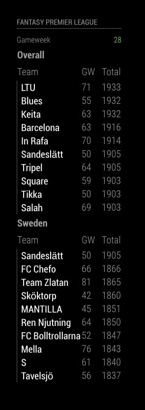
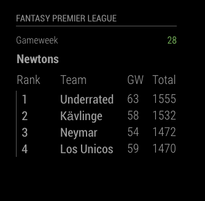
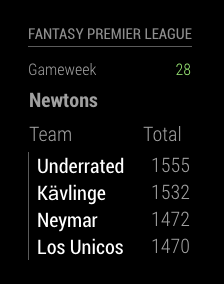
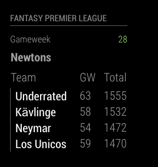
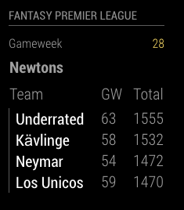

# MMM-Fantasy-Premier-League

This is a module for the [MagicMirror²](https://github.com/MichMich/MagicMirror/).

This module displays your Fantasy Premier League! 
Display current standing and latest points.


## Install

1. Navigate into your MagicMirror modules folder and execute
    git clone this repository
2. Enter the MMM-Fantasy-Premier-League directory and execute npm install.
3. Visit https://fantasy.premierleague.com. Enter selected league and look at the URL:
    https://fantasy.premierleague.com/a/leagues/standings/{LEAGUE ID}/classic
4. Copy the {LEAGUE ID} and paste it in the config file under leagueIds.

```js
leagueIds: [
    {id: 313}, // Overall
    {id: 226}  // Sweden
]
```


To use this module, add the following configuration block to the modules array in the `config/config.js` file:
```js
var config = {
    modules: [
        {
            module: 'MMM-Fantasy-Premier-League',
            position: 'left',
            header: "Fantasy Premier League",
            config: {
                // configure
            }
        }
    ]
}
```

Example config: 
```js
{
    module: 'MMM-Fantasy-Premier-League',
    position: 'left',
    header: "Fantasy Premier League",
    config: {
        leagueIds: [
            {id: 313},
        //  {id: {Another Id}},
        ],
        maxTeams: 15,
    }
},
```

## Configuration options

| Option           | Default   | Description
|------------------|-----------|-----------------------------------------
| `leagueIds`      |           | *Optional* List of league ids
| `updateInterval` |  21600000 | *Optional* How often should the module fetch?
| `maxTeams`       |  10       | *Optional* How many teams should max be viewed in every league?
| `showTeamName`   |  true     | *Optional* Display team name
| `showPlayerName` |  false    | *Optional* Display player name
| `showPlayerRank` |  false    | *Optional* Display player rank
| `showTotalPoints`|  true     | *Optional* Display total point of player in the current league
| `showGwPoints`   |  true     | *Optional* Display latest or ongoing gameweek points
| `gameWeekLabel`   | "Gameweek"| *Optional* If you want you can rename the Gameweek header("GW or whatever")
| `showGameWeek`   |  true     | *Optional* Whether or not you want to display latest or ongoing gameweek
| `truncateAfter`  |    5      | *Optional* A value > 0 will truncate league name/ player name/ team name at first space after <value> characters. 0 = no truncation


## Screenshot




Green gameweek = done gameweek!

Yellow gameweek = ongoing gameweek!





